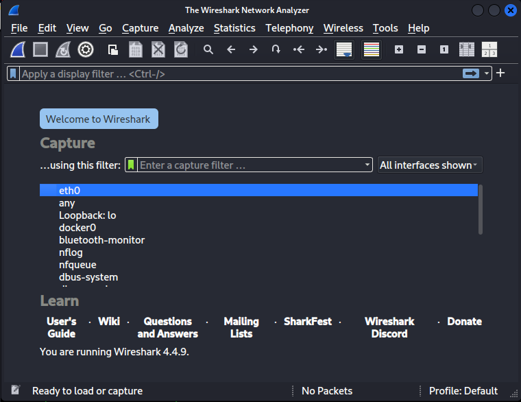
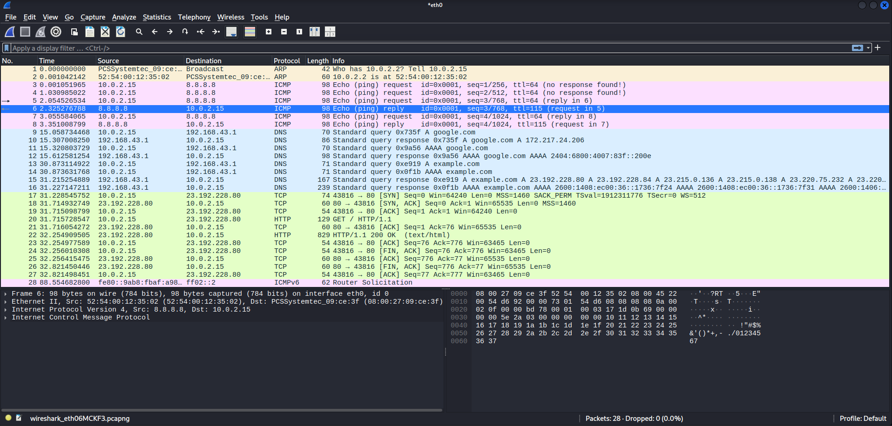
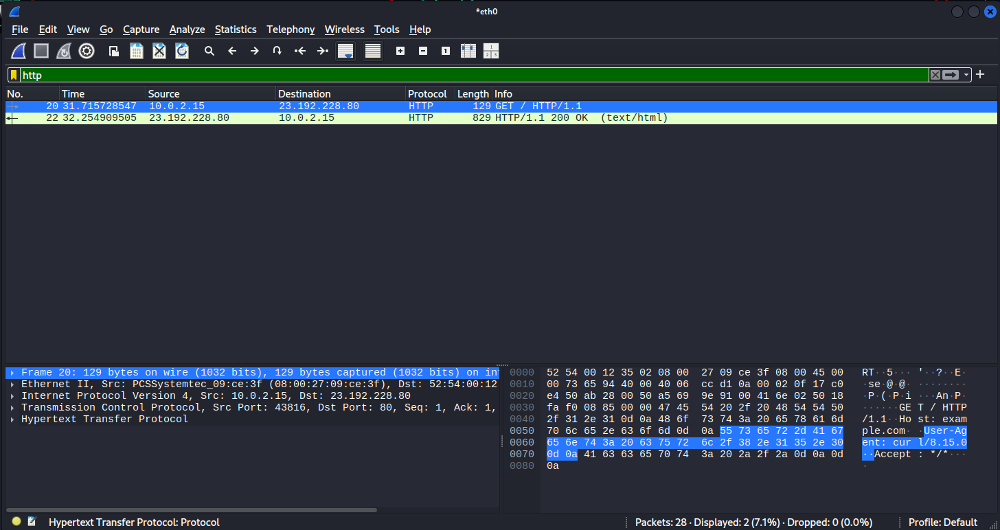
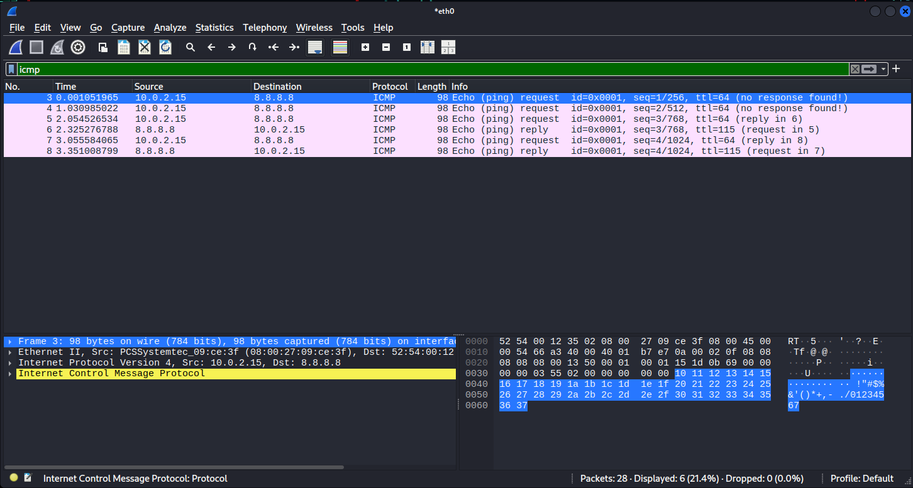
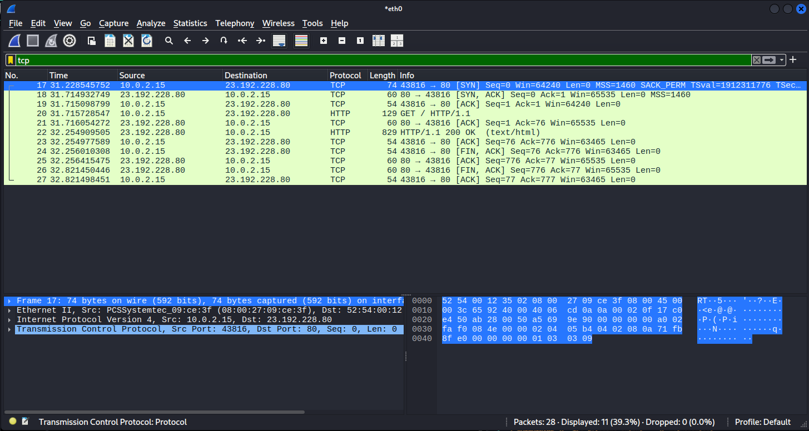

# Capture and Analyze Network Traffic using Wireshark

## 🎯 Objective
Capture live network packets and identify basic protocols and traffic types using Wireshark.

## 🧰 Tools Used
- Kali Linux (VirtualBox)
- Wireshark
- ping / nslookup / curl commands

## 🧪 Steps Performed
1. Installed Wireshark using `sudo apt install wireshark`.
2. Captured live packets on `eth0` interface.
3. Generated traffic using:
   - `ping -c 4 8.8.8.8`
   - `nslookup google.com`
   - `curl http://example.com`
4. Applied filters:
   - `http`
   - `dns`
   - `icmp`
   - `tcp`
5. Analyzed each protocol and saved results as screenshots.
6. Exported capture as `capture.pcapng`.

## 📊 Protocols Identified
| Protocol | Description | Example |
|-----------|--------------|----------|
| HTTP | Web traffic for websites | GET /index.html |
| DNS | Domain name resolution | Query for google.com |
| ICMP | Ping packets | Echo request/reply |
| TCP | Transport layer protocol | SYN, ACK packets |

## 📸 Screenshots

### 1️⃣ Start Capture on Network Interface

### 2️⃣ Live Packet Capture

### 3️⃣ HTTP Packets (Filtered View)

### 4️⃣ DNS Packets (Filtered View)

### 5️⃣ ICMP Packets (Filtered View)

### 6️⃣ TCP Packets (Filtered View)

## 🧩 Outcome
- Successfully captured and analyzed network traffic.
- Identified multiple common protocols.
- Learned packet inspection and Wireshark filtering.

## 👩‍💻 Author
**Srushti Dave**
